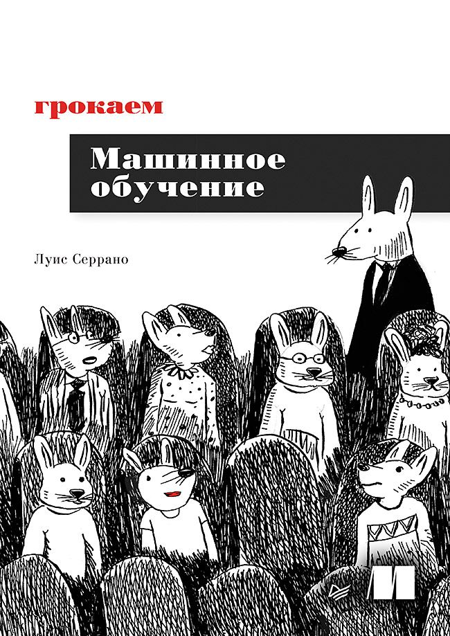

# грокаем Машинное обучение

Эта книга научит двум вещам: моделям машинного обучения и тому, как их использовать. Модели машинного обучения бывают разных типов. Некоторые из них возвращают детерминированный ответ, такой как «да» или «нет», а другие — ответ в виде вероятности. Одни из них используют уравнения, другие — операторы if. Их общая черта заключается в том, что все они возвращают ответ или прогноз. Отрасль машинного обучения, которая включает в себя модели, возвращающие прогноз, удачно названа прогностическим машинным обучением. На этом типе машинного обучения мы и сосредоточимся.

